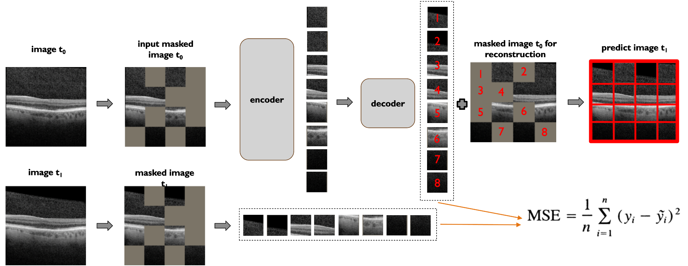
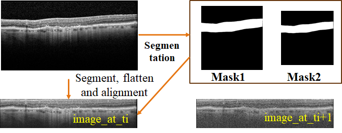
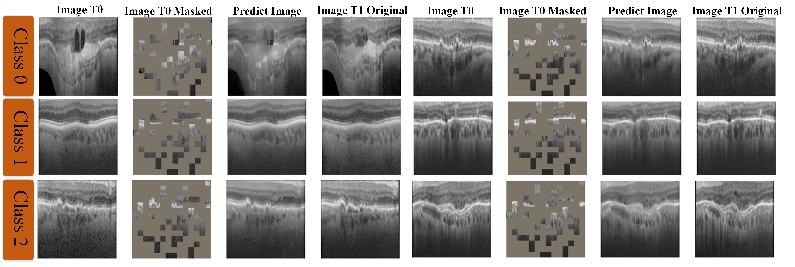

# MARIO Challenge – Team DF41

This repository contains our team solution for the **MICCAI 2024 MARIO Challenge**, focusing on **retinal disease progression analysis from OCT imaging**.

This work is based on our paper:  

**"Patch Progression Masked Autoencoder with Fusion CNN Network for Classifying Evolution Between Two Pairs of 2D OCT Slices"**  

P. Zhang et al., MICCAI 2024.  

[Paper link](https://link.springer.com/chapter/10.1007/978-3-031-86651-7_9)

---

## 🧠 Overview

Age-related Macular Degeneration (AMD) is a major cause of vision loss. Monitoring disease progression using OCT imaging is critical for treatment decisions.

The MARIO challenge addresses two tasks:

- **Task 1**: Classify disease evolution between two consecutive OCT scans  
- **Task 2**: Predict disease progression from a single OCT scan

Our approach combines:
- **CNN-based fusion models** for classification
- **Masked Autoencoders (MAE)** for temporal prediction
- **Model ensembling** for robustness
- **OCT preprocessing (OCTIP)** for alignment and ROI extraction

---

## 📂 Repository Structure

```
.
├── configs/                  # YAML configuration files
├── csv/                      # Input metadata (challenge format)
├── models/                   # Model definitions (weights not included)
├── utils/                    # Preprocessing, datasets, MAE, scoring
├── inference_pipeline_task_1.py
├── inference_pipeline_task_2.py
├── Dockerfile
├── requirements.txt
└── README.md
```

---

## ⚙️ Methodology

### 🔹 Task 1 – Evolution Classification

We model disease evolution using **fusion CNN architectures**.

- **Early Fusion**: concatenate (t0, t1) along channels → ResNet50 → 4-class output  
- **Late Fusion**: extract features independently (2048 + 2048) → FC classifier  
- **Training**: 4-fold cross-validation  
- **Inference**: ensemble across folds

---

### 🔹 Task 2 – Progression Prediction

Only **one OCT scan (t0)** is available. We convert it into a temporal problem.

## 🧩 Patch Progression Masked Autoencoder (PPMAE)

We employed a Masked Autoencoder to generate a synthetic OCT image. Instead of reconstructing the same image, we **predict the future OCT (t1)** from t0.

- Mask ~75% of patches
- Encode visible patches
- Decode to reconstruct **future** patches
- Loss: MSE on predicted t1 patches



---

### 🔁 Final Pipeline (Task 2)

1. Input OCT at time `t0`  
2. Generate predicted OCT `t1` using PPMAE  
3. Apply Task 1 classifier on `(t0, predicted t1)`

👉 Converts Task 2 into a **synthetic temporal classification** task

---

## 🧪 Data Processing (OCTIP)

- Retina alignment (flattening)
- Noise removal
- Segmentation (EfficientNet-based FPN)
- ROI-focused crops



---

## 📊 Results

- **Top 10 – MICCAI 2024 MARIO Challenge**
- Gains from:
  - OCTIP preprocessing
  - Ensembling
  - PPMAE-based reconstruction

**Qualitative examples (PPMAE):**



---

## 🚀 Usage

**Task 1**
```
python inference_pipeline_task_1.py
```

**Task 2**
```
python inference_pipeline_task_2.py
```

---

## ⚠️ Data & Models

This repository does **not include**:
- Challenge dataset
- Model checkpoints (.pth / .hdf5)

To run the code, provide:
- MARIO dataset
- Pretrained weights (paths configurable via YAML)

---

## 🧰 Configuration

- `configs/config_task1.yaml`
- `configs/config_task2.yaml`

---

## 🧑‍💻 Author

**Philippe Zhang**  
PhD – Medical Imaging & Deep Learning

---

## 🔗 References

- MARIO Challenge: https://youvenz.github.io/MARIO_challenge.github.io/
- OCTIP: https://github.com/leto-atreides-2/octip